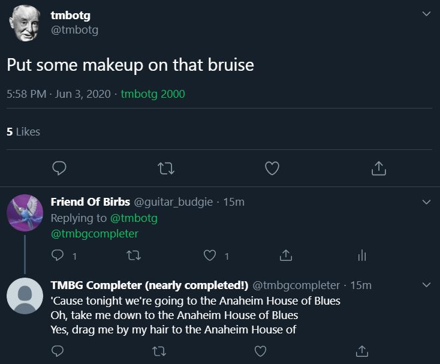

# They Might Be Giants Lyrics Completer Bot

[@tmbgcompleter](https://twitter.com/tmbgcompleter) is an interactive Twitter bot that replies to a user with the next lyrics of a They Might Be Giants song.

## Acknowledgements

Thanks to [They Might Be Giants](tmbg.com) for installing and servicing melody since 1982. Thanks to [This Might Be A Wiki](tmbw.net) for their dedication to neatly organizing all things They Might Be Giants. Thanks to [@bgporter](https://github.com/bgporter) for creating [@tmbotg](https://twitter.com/tmbotg) and for writing very helpful [blog posts](https://artandlogic.com/?s=tmbotg) on how to make a Twitter bot.

## Usage

This bot is freely available to everyone who tags [@tmbgcompleter](https://twitter.com/tmbgcompleter) on Twitter.
The bot will like each tweet that mentions it.

### Tagging the bot alongside lyrics

If you want the bot to reply to your tweet containing lyrics, just tag @tmbgcompleter in your tweet.

### Tagging the bot under lyrics

The bot can also reply to a tweet above containing lyrics. If you would like the bot to complete lyrics from an existing tweet containing lyrics, reply and tag @tmbgcompleter.

## How does it work? Where does it live?

1. The bot listens for mentions of its handle.
2. If there is a mention, it likes the tweet and determines if the lyrics are in the tweet or above the tweet.
3. It then gets the lyrics, puts it into the [tmbw.net search engine](http://tmbw.net/wiki/index.php?title=Special%3ASearch&profile=advanced&search=&fulltext=Search&ns100=1&profile=advanced), and gets the lyrics page.
4. Then, it finds the most similar phrase to the user's tweet, gets the next 3 lines, and tweets it out to whoever mentioned it.

The bot is hosted on [repl.it](repl.it) and pinged every 20 minutes with [Uptime Robot](https://uptimerobot.com/). If there's an error, the bot will DM me.

See the code for more interesting details! You are free to use my code to make your own twitter bot. I have made it easy to swap out my bot's handle and my handle for your own. All helper functions are in particle.py. The main.py file contains a fully functional streaming bot, just swap out the [secrets](https://developer.twitter.com/en/docs/basics/authentication/guides/authentication-best-practices) and the on_success function with what you want your own bot to do and you're set!

## License
[MIT](https://choosealicense.com/licenses/mit/)
